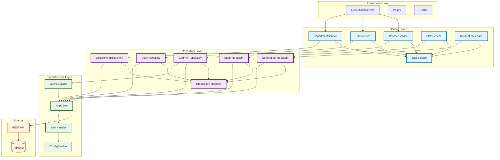
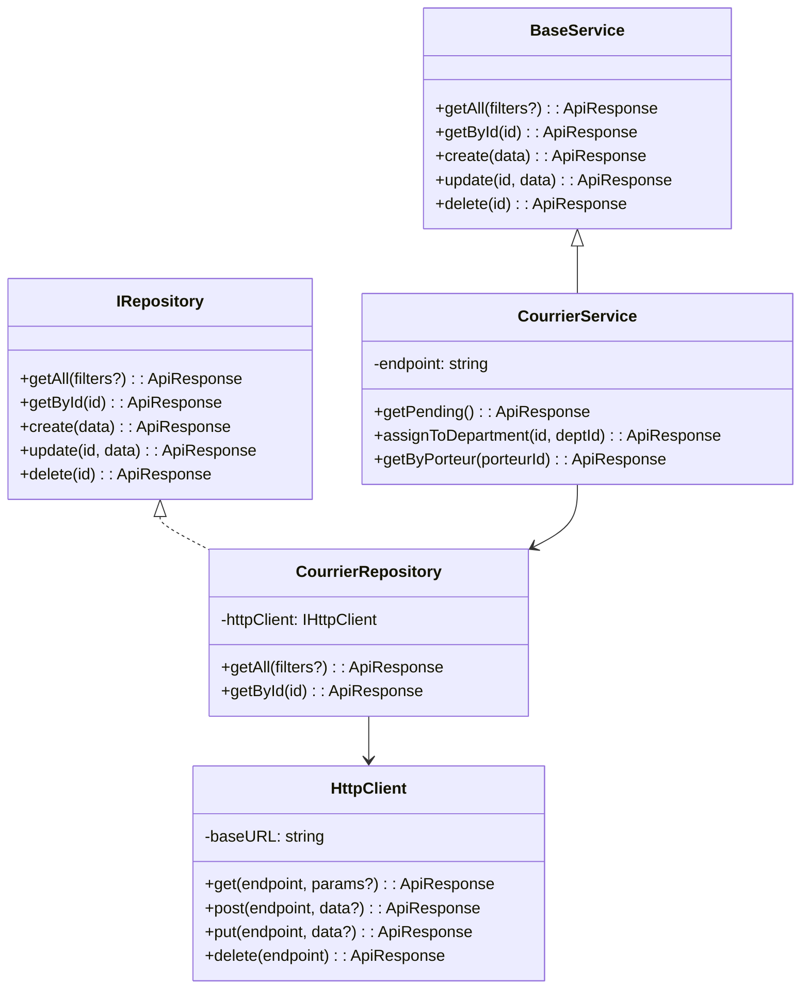
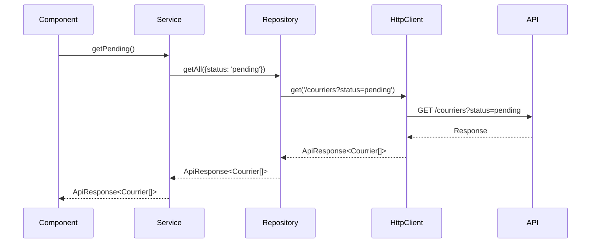

# Architecture Diagram



## Class Diagram



## Sequence Diagram - Service Call Flow



## Directory Structure

```
src/
├── services/
│   ├── base/
│   │   ├── BaseService.ts
│   │   └── interfaces.ts
│   ├── courriers/
│   │   ├── CourrierService.ts
│   │   └── CourrierRepository.ts
│   ├── users/
│   │   ├── UserService.ts
│   │   └── UserRepository.ts
│   ├── departments/
│   │   ├── DepartmentService.ts
│   │   └── DepartmentRepository.ts
│   ├── stats/
│   │   ├── StatsService.ts
│   │   └── StatsRepository.ts
│   ├── notifications/
│   │   ├── NotificationService.ts
│   │   └── NotificationRepository.ts
│   ├── infrastructure/
│   │   ├── HttpClient.ts
│   │   ├── CacheService.ts
│   │   ├── ErrorHandler.ts
│   │   └── ConfigService.ts
│   ├── ServiceRegistry.ts
│   └── index.ts
├── repositories/
│   └── interfaces/
│       └── IRepository.ts
└── types/
    └── api.ts